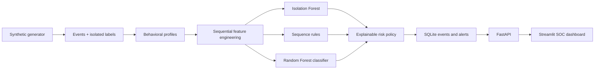

# Honeywell Behavioral Anomaly Detection Platform

An explainable, near-real-time behavioral security platform built for the
Honeywell Campus Connect Hackathon. It models normal user and device activity,
detects unknown and known attacks, ranks alerts by operational risk, and gives
SOC analysts evidence-backed explanations and recommended actions.

## Problem

Static security rules miss novel behavior and often overwhelm analysts with
false positives. Industrial enterprises also have heterogeneous identities:
employees, service accounts, IoT devices, and edge systems. Each requires an
individual baseline while still supporting new entities and legitimate change.

## Solution

- Realistic sequential synthetic access logs with separate ground truth
- Per-entity, department, entity-type, and organization behavioral profiles
- Sequential features using prior events, transitions, rolling failures, travel,
  device novelty, and cumulative transfer behavior
- Isolation Forest for unknown anomalies
- Deterministic sequence rules for seven attack families
- Class-weighted Random Forest attack classification
- Explainable 0–100 risk scoring and ranked alerts
- Cold-start confidence reduction with peer baselines
- Trusted exponential-decay updates for concept drift
- SQLite-backed replay, FastAPI, and a dark Streamlit SOC dashboard

## Architecture



The online event path never reads ground-truth labels. Labels are joined only
inside evaluation commands.

## Quick start

Prerequisites: Python 3.11 or 3.12 and Git.

```bash
python -m venv .venv
# Windows: .\.venv\Scripts\Activate.ps1
# Linux/macOS: source .venv/bin/activate
python -m pip install --upgrade pip
python -m pip install -e ".[dev,ml,dashboard]"
```

Copy `.env.example` to `.env` if environment overrides are needed.

### One-command demo

Windows:

```powershell
powershell -ExecutionPolicy Bypass -File scripts/run_demo.ps1
```

Linux/macOS:

```bash
bash scripts/run_demo.sh
```

Open <http://127.0.0.1:8501>. The script validates data, trains the fast model,
initializes SQLite, starts the API and dashboard, and replays all 2,000 events.

## Manual commands

```bash
badp generate-data --generator-config config/generator/demo.yaml --output data/samples/honeywell_demo
badp train-model --dataset data/samples/honeywell_demo --training-config config/training/fast.yaml --output artifacts/models/fast
badp evaluate-model --dataset data/samples/honeywell_demo --model artifacts/models/fast/model.joblib --output artifacts/models/fast/full-evaluation.json
badp serve
streamlit run dashboard/app.py
```

Start replay:

```bash
curl -X POST http://127.0.0.1:8000/api/v1/replay/start \
  -H "Content-Type: application/json" \
  -d '{"interval_ms":25,"max_events":2000}'
```

API docs: <http://127.0.0.1:8000/docs>

## Detection and risk scoring

The feature set includes login-hour deviation, device and source novelty,
geographic distance and velocity, unusual resources, failure frequency,
session-duration deviation, transition rarity, time since prior activity,
cumulative transfer volume, and entity history.

The risk policy combines anomaly confidence, classification confidence,
deterministic rule evidence, behavioral deviation, resource sensitivity, device
novelty, geographic anomaly, and historical behavior. Every alert contains
contributing factors, a concise deterministic explanation, and analyst actions.

## Cold start and concept drift

Entities with insufficient history use department, entity-type, then
organization baselines. Their confidence is reduced and alerts are marked
`cold_start`. Recent trusted behavior updates an exponential-decay baseline.
Anomalous events never update it, preventing baseline poisoning. Alerts and
entity views expose `warming_up`, `stable`, `adapting`, or `drifting` status.

## Evaluation

Fast-preset held-out results on the committed 2,000-event demo dataset:

| Metric | Result |
|---|---:|
| Precision | 64.29% |
| Recall | 100.00% |
| F1 | 78.26% |
| PR-AUC | 57.71% |
| False-positive rate | 0.85% |
| Top-1% precision | 50.00% |
| Top-1% recall | 33.33% |

All seven attack categories appear in per-attack output. Detailed sample results
are in [`submission/results/metrics.json`](submission/results/metrics.json).

## Dashboard

The analyst interface includes executive metrics, live events, risk-ranked
alerts, risk and attack distributions, risky entities, alert explanations,
recommended response actions, entity behavioral history, cold-start/drift
indicators, evaluation metrics, confusion matrix, and system health.

## Testing

```bash
ruff format --check .
ruff check .
mypy
pytest
```

GitHub Actions runs the same quality checks on every push.

## Repository map

- `backend/src/behavioral_security/`: domain, ML, API, replay, and persistence
- `dashboard/`: Streamlit analyst dashboard
- `config/`: runtime, generator, and training presets
- `data/samples/honeywell_demo/`: bounded 2,000-event demonstration dataset
- `scripts/`: one-command demo and shutdown scripts
- `submission/`: report, presentation content, architecture, and sample results

## Limitations

- Synthetic data cannot reproduce every enterprise network dependency.
- The demo model is trained on a small, intentionally imbalanced dataset.
- Replay state is local SQLite and designed for a single demo process.
- Authentication, RBAC, distributed streaming, model signing, and analyst
  feedback retraining are production follow-on work.
- Deep sequence models were intentionally excluded for reliability and speed;
  rolling and transition features provide the sequence-aware MVP.

No secrets, real identities, large checkpoints, or production network addresses
are included.
