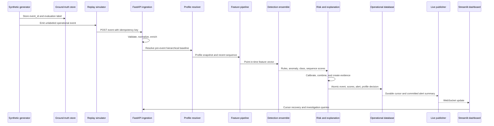

# Data Flow and ML Strategy

## Complete data flow



## Generation

The generator first constructs a synthetic organization:

- departments, sites, shifts, roles, resources, and sensitivity tiers
- users, service accounts, IoT devices, and edge devices
- normal device, location, schedule, authentication, and resource relationships
- entity-specific random state derived from a master seed

Normal events are sampled from each entity's profile. Attack schedulers select
eligible entities and modify a coherent series of events, not isolated labels.
Campaign metadata remains in ground truth. A configuration validator rejects
incompatible attack/entity combinations and invalid percentages.

Required schema fields remain available. Versioned optional fields such as
`auth_outcome`, `department`, `bytes_transferred`, `destination`, and
`resource_sensitivity` provide evidence needed for brute force, peer baselines,
exfiltration, lateral movement, and risk context.

## Ingestion and enrichment

The API:

1. validates schema version, identifiers, UTC time, IP, enums, and bounds;
2. rejects or idempotently resolves duplicates;
3. resolves resource sensitivity and entity metadata;
4. derives geodesic distance, local hour, inter-event time, and trust context;
5. loads an event-time-safe profile and sequence;
6. passes immutable normalized data to feature extraction.

No ground-truth field is accepted by the operational scoring contract.

## Point-in-time feature families

| Family | Examples |
|---|---|
| Temporal | circular hour distance, weekday likelihood, shift deviation |
| Authentication | method rarity, failure rate, burst count, method transition |
| Geography | location rarity, travel velocity, site trust, IP novelty |
| Device | fingerprint novelty, device/entity conflict, device trust |
| Session | robust duration z-score, deviation from peer duration |
| Resource | resource rarity, sensitivity, peer rarity, first access |
| Sequence | transition surprise, command token sequence, recent resource path |
| Volume | rolling access and transfer totals at several windows |
| Trust | historical entity, device, geo, and analyst-confirmed trust |
| Maturity | sample size, profile age, baseline blend weights |

Categorical encodings are learned only from training data. Unknown values map to
explicit unknown buckets. Numeric transforms and feature order are stored in a
versioned feature schema shared by training and inference.

## Behavioral profile resolution

### Cold start

The effective baseline is a maturity-weighted shrinkage estimate:

```text
effective = w_entity * entity
          + w_department * department
          + w_entity_type * entity_type
          + w_organization * organization
```

`w_entity` increases smoothly with effective sample size. A low-maturity entity
receives wider uncertainty bounds and cannot be marked critical on weak
personal-novelty evidence alone. Strong deterministic attack evidence remains
actionable during cold start.

### Continuous learning

After scoring, each observation is assigned one of three update policies:

- **accept:** normal or analyst-confirmed benign; normal learning weight;
- **down-weight:** uncertain, low-to-medium risk; reduced learning weight;
- **quarantine:** high risk or confirmed malicious; no automatic normalization.

Updates are idempotent and use exponential time decay plus bounded recent
windows. Profile snapshots are versioned for reproducibility.

### Concept drift

Drift is assessed by cohort and feature using:

- Population Stability Index for stable binned numeric/categorical features;
- Jensen-Shannon divergence for behavior distributions;
- Page-Hinkley change detection on score and residual streams;
- sustained changes in profile likelihood and analyst-benign feedback.

One drift signal does not immediately retrain a model. A policy requires minimum
volume, persistence, and acceptable feedback quality. Natural shifts adapt
through decay first; model recalibration or retraining is separately versioned.

## Detection ensemble

### Deterministic security analytics

Rules supply high-precision evidence for behaviors with explicit semantics:

- impossible travel from distance and elapsed time;
- brute-force bursts and failure-to-success patterns;
- credential-stuffing campaigns across identities;
- conflicting device fingerprints;
- rare/sensitive resource transitions;
- rolling low-and-slow transfer accumulation.

Rules are configurable policies, not hardcoded conditions. Each finding records
observed facts, threshold, rule version, confidence, and severity.

### Unknown-attack models

| Model | Role | Justification | Limitation/control |
|---|---|---|---|
| Isolation Forest | Default tabular novelty detector | Fast, robust, nonlinear, suitable for mostly normal data | Segment and calibrate scores; avoid treating raw score as probability |
| One-Class SVM | Benchmark and bounded-cohort detector | Strong nonlinear boundary for compact standardized datasets | Memory/time scale poorly; disabled above configured cohort size |
| PyTorch autoencoder | Nonlinear reconstruction detector | Captures correlated deviations and exposes per-feature reconstruction error | Regularization, early stopping, robust scaling, and held-out thresholding required |

All three adapters will be complete and interchangeable. The default MVP runs
Isolation Forest; the advanced ensemble can run Isolation Forest plus the
autoencoder. One-Class SVM remains selectable and fully evaluated rather than
being placed on the high-throughput default path.

### Known-attack classifiers

| Model | Role | Justification |
|---|---|---|
| Random Forest | Default explainable baseline | Robust on mixed tabular features, class weighting, stable feature importance |
| XGBoost | High-accuracy alternative | Strong nonlinear boosted classification and imbalance controls |
| LightGBM | Throughput-oriented alternative | Efficient training and prediction on larger tabular datasets |

Every classifier predicts `normal` plus all seven attack families. Probabilities
are calibrated on a validation partition. Promotion is based on time-ordered
macro-F1, per-class recall, PR-AUC, calibration error, and latency—not accuracy
alone.

### Sequential models

Events are grouped by entity, ordered by event time, windowed, padded, and
masked. Tokens include resource, command, authentication, device-change, time
gap, geography, outcome, and numeric behavioral features.

| Model | Purpose | Decision |
|---|---|---|
| LSTM | Strong recurrent benchmark for longer dependencies | Complete selectable adapter |
| GRU | Lower-compute recurrent detector | Default MVP sequence model |
| Transformer encoder | Long-range and cross-event dependencies | Advanced default when data volume and hardware justify it |

Sequence leakage is prevented with time-based splits and entity-aware windows.
Late events outside the allowed watermark do not retroactively alter already
evaluated sequences.

## Sequential behavior handling

Two complementary representations are used:

1. A smoothed first-order resource transition graph gives immediate, auditable
   transition surprise.
2. LSTM, GRU, and Transformer encoders learn longer event and command patterns.

The sequence detector returns a calibrated anomaly probability and time-step or
feature contributions. It does not replace tabular behavior because many SOC
signals are point-in-time or aggregate context.

## Class imbalance handling

- Generate realistic imbalance while guaranteeing enough training examples per
  attack in a training-only scenario configuration.
- Use time-ordered train, validation, calibration, and test partitions.
- Apply class weights or balanced bootstrap for tree models.
- Use `scale_pos_weight`/sample weights for boosting as appropriate.
- Use weighted cross-entropy or focal loss for neural classifiers.
- Oversample only within the training partition and preserve coherent sequences.
- Select thresholds using PR curves and alert-budget constraints.
- Report macro metrics and per-attack results so majority normal events cannot
  hide a failed attack class.

Synthetic evaluation will also include an untouched natural-prevalence test set.

## False-positive controls

1. Hierarchical cold-start baselines and wider uncertainty for immature profiles.
2. Per-entity-type calibration instead of one global threshold.
3. Rule/model corroboration for critical severity unless one rule is conclusive.
4. Trusted device, location, historical behavior, and resource context.
5. Multi-window persistence for slow attacks and transient-noise suppression.
6. Alert grouping, deduplication, cooldowns, and campaign correlation.
7. Profile poisoning protection through quarantine.
8. Analyst dispositions used only after validation and with auditable provenance.
9. Operating thresholds optimized against false-positive and alert-budget goals.
10. Drift monitoring to distinguish system-wide change from individual attack.

## Attack classification and score fusion

Raw outputs are never directly added. Each output is calibrated to a comparable
confidence scale and retained with its version. A versioned fusion policy uses:

- maximum or weighted anomaly evidence;
- calibrated known-attack probabilities;
- sequence anomaly confidence;
- deterministic rule severity/confidence;
- behavioral deviation and profile maturity;
- historical, device, and geographic trust;
- resource sensitivity.

Risk contributions are transformed and bounded to `0–100`. Severity bands and
alert thresholds are configuration. The exact component vector and policy
version are stored with every assessment.

## Explainability

Explanations use model-specific evidence:

- rules: exact observed fact versus configured threshold;
- profile features: observed value versus individual/peer baseline;
- tree classifiers: per-event feature contribution from an approved tree
  explainer with feature names and directions;
- autoencoder: normalized per-feature reconstruction contribution;
- recurrent/Transformer models: integrated-gradient contribution over features
  and time steps, with attention shown only as context rather than proof.

The narrative engine ranks material positive and mitigating contributions. Every
alert must include risk score, severity, attack hypothesis, confidence, profile
maturity, baseline level, top reasons, expected and observed values, model/rule
versions, and related evidence identifiers.

## Near-real-time processing

- The simulator replays event time at a configurable speed.
- FastAPI accepts individual or bounded batch events.
- A bounded asynchronous queue applies backpressure.
- Entity-keyed locking preserves per-entity order.
- CPU-heavy model inference uses controlled workers; PyTorch models batch within
  a short maximum latency window.
- SQLite uses WAL, a single writer, and short atomic transactions.
- A committed cursor is published over WebSocket.
- The dashboard recovers from disconnection with cursor-based incremental REST
  queries, then resumes live updates.

The MVP target is at least 100 events/second, p95 processing below 250 ms, and
p95 event-to-dashboard visibility below two seconds on documented hardware.

## Training and promotion lifecycle

1. Generate versioned training and natural-prevalence evaluation datasets.
2. Validate schema, labels, scenario invariants, and distribution summaries.
3. Fit preprocessing on the training partition only.
4. Train candidate models with deterministic seeds.
5. Tune using validation data without touching the final test set.
6. Calibrate probabilities and select operating thresholds.
7. Evaluate overall, per attack, per entity type, and profile maturity.
8. Persist artifact, hash, feature schema, config, metrics, and model card.
9. Promote only candidates passing quality, latency, and compatibility gates.
10. Load through a trusted registry and expose version/health to the SOC.
