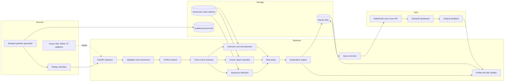

# Final System Architecture Proposal

## Architectural drivers

The design prioritizes explainable detection, low false positives, adaptation,
repeatable evaluation, near-real-time behavior, and a credible migration path
from a hackathon deployment to an enterprise SOC service.

## Clean Architecture layers

### Domain

Framework-independent entities and policies:

- `SecurityEvent`, `EntityIdentity`, and `GroundTruthRecord`
- `BehavioralProfile` and hierarchical baseline value objects
- `FeatureVector`, `ModelPrediction`, and `RuleFinding`
- `RiskAssessment`, `Explanation`, `Alert`, and `AnalystDisposition`
- repository, model, clock, publisher, and transaction ports

Domain types enforce invariants such as UTC timestamps, risk bounds, immutable
event identifiers, valid entity types, and non-negative evidence contributions.

### Application

Use cases coordinate domain behavior:

- ingest and score an event
- update or quarantine a profile observation
- replay a simulation
- train, evaluate, promote, and load a model
- query events, alerts, profiles, and system health
- disposition an alert and apply approved feedback

Transaction and idempotency boundaries live here. Application services depend
only on domain ports.

### Infrastructure

Adapters provide:

- SQLite persistence in WAL mode
- scikit-learn, PyTorch, XGBoost, and LightGBM model implementations
- versioned model artifact storage
- YAML and environment configuration
- structured logging, health metrics, and audit records
- in-process publication and cursor-based durable recovery

### Presentation

- FastAPI provides versioned REST and WebSocket contracts.
- Streamlit provides the SOC dashboard through the public API only.
- CLI scripts invoke application use cases through the same composition root.

## Component view



## Deployment view

The initial Compose deployment contains:

1. `api`: FastAPI ingestion, inference, queries, and live publication.
2. `dashboard`: Streamlit SOC interface.
3. `simulator`: deterministic generation or replay client.
4. A persistent volume for SQLite, model artifacts, and generated datasets.

SQLite is appropriate for a portable single-node demonstration when writes use
a bounded single-writer queue, short transactions, WAL mode, busy timeouts, and
batched non-critical metrics. Repository and publisher ports allow later
replacement by PostgreSQL and Kafka without domain changes.

## Event and label contracts

The required event attributes are:

```text
entity_id, entity_type, timestamp, source_ip, geo_location,
resource_accessed, auth_method, session_duration, command_sequence,
device_fingerprint
```

An immutable `event_id` is added for idempotency and evidence correlation.
Enterprise detection also needs `auth_outcome`, `department`,
`resource_sensitivity`, and transfer/context attributes. These are versioned
optional extensions; the required attributes remain stable.

The generator produces labels, but operational ingestion never receives them:

```text
security_events(event_id, operational fields...)
ground_truth(event_id, label, attack_campaign_id, generation_metadata...)
```

Only offline evaluation repositories can access both. An architecture test will
prevent the online feature and detection packages from importing ground-truth
repositories.

## Persistence design

Planned logical tables:

| Table | Purpose |
|---|---|
| `entities` | Identity type, department, status, and metadata |
| `security_events` | Immutable normalized operational events |
| `ground_truth` | Evaluation-only labels and campaign metadata |
| `behavioral_profiles` | Current profile snapshot and maturity |
| `profile_versions` | Auditable historical profile snapshots |
| `model_predictions` | Per-model raw/calibrated scores and versions |
| `rule_findings` | Deterministic evidence and severity |
| `risk_assessments` | Component vector, policy version, and final score |
| `alerts` | Triage lifecycle and correlation keys |
| `alert_reasons` | Ordered evidence contributions |
| `analyst_feedback` | Append-only dispositions, notes, and actor/time |
| `model_registry` | Artifact path, feature schema, metrics, and status |
| `simulation_runs` | Seed, scenario configuration, and replay cursor |
| `system_metrics` | Bounded operational metric snapshots |

Important indexes cover event time, entity/time, alert status/severity/time,
attack family/time, device fingerprint, simulation run, and replay cursor.
Foreign keys and schema migrations are mandatory.

Profile state will use typed JSON payloads initially because feature families
evolve rapidly. Version, checksum, maturity, and timestamps remain relational
columns. Repository code owns serialization and upgrade logic.

## API design

All business endpoints are under `/api/v1`.

| Group | Representative operations |
|---|---|
| `/events` | ingest, batch ingest, list, inspect |
| `/stream` | WebSocket live event and alert feed |
| `/alerts` | list, inspect, acknowledge, disposition |
| `/profiles/users` | list and inspect user behavior |
| `/profiles/devices` | list and inspect device behavior |
| `/risk` | timeline, distribution, top entities |
| `/investigations` | related evidence, timeline, analyst notes |
| `/models` | active versions, health, evaluation summaries |
| `/simulation` | runs, status, start/stop controls |
| `/system` | throughput, latency, drift, queue, storage |

`/health`, `/ready`, and `/metrics` are operational endpoints. Contracts include
pagination, filtering, stable error envelopes, request correlation identifiers,
UTC ISO-8601 timestamps, examples, and explicit response models. Mutations use
idempotency keys where retry is expected.

## Processing consistency

- Events are immutable and identified by `event_id`.
- Duplicate ingestion returns the original result without updating profiles.
- Feature extraction reads the profile version before the event.
- Event, predictions, risk, explanation, and profile decision commit together.
- The profile update may accept, down-weight, or quarantine the observation.
- Live messages contain a durable cursor; clients recover missed items by query.
- Events for one entity are ordered. Late events are marked and handled by a
  bounded lateness policy rather than silently rewriting history.

## Security architecture

- Pydantic validation and allow-listed enum values at the boundary.
- Authentication abstraction with local demo credentials and production OIDC
  integration point.
- Role policies for viewer, analyst, model operator, and administrator.
- Rate and payload limits at middleware/proxy boundaries.
- No secrets in source, YAML, logs, datasets, or model metadata.
- Append-only audit evidence for dispositions and model promotion.
- Artifact manifests include hashes, expected classes, feature schema, library
  versions, and trusted local path validation before loading.
- Error responses are sanitized; detailed errors remain in structured logs.
- Security headers and narrowly configured CORS.

Synthetic IP addresses and identities use non-sensitive reserved ranges and
fictional identifiers.

## Observability

Structured JSON logs carry correlation, event, entity, simulation, alert, and
model-version identifiers. Metrics include:

- ingest and scoring throughput
- stage and end-to-end latency histograms
- queue depth, retries, duplicates, and late events
- alert volume, severity, attack prediction, and suppression
- model score distributions and calibration health
- profile maturity and quarantine rates
- drift statistics by segment
- database and WebSocket health

Readiness fails when required model artifacts, migrations, or persistence are
unavailable. Liveness only indicates that the process can respond.

## Configuration strategy

Validated settings combine:

1. safe typed defaults
2. `config/base.yaml`
3. environment-specific YAML
4. environment-variable overrides

Configuration includes random seeds, entity populations, attack mix, replay
rate, windows, decay, feature schema, enabled models, thresholds, risk weights,
database paths, retention, and logging. Secrets are environment-only.

## Architecture decisions

| Decision | Rationale | Trade-off |
|---|---|---|
| Python 3.11 baseline | Broad compatibility across PyTorch, boosting, Streamlit, and ML tooling | Does not use newest language runtime |
| Streamlit as dashboard client | Required stack and fast polished SOC delivery | Less frontend control than React |
| SQLite WAL for initial deployment | Portable, inspectable, zero external service | Single-node write ceiling |
| Ports for database and event publication | Preserves migration path | More interfaces and contract tests |
| Separate labels from events | Prevents leakage and preserves fair evaluation | Evaluation requires explicit join |
| Hybrid rules, anomaly, classifier, sequence ensemble | Covers deterministic and novel threats while retaining evidence | Calibration and arbitration complexity |
| GRU as default sequence model | Better latency/data efficiency for MVP | Transformer may win with larger history |
| Point-in-time features | Prevents self-normalization and future leakage | Requires careful transaction ordering |
| Quarantined profile learning | Reduces attacker-driven profile poisoning | Slower adoption of legitimate abrupt change |
| Versioned risk policy and evidence | Reproducible, auditable alert decisions | Additional persistence |

## Scalability path

The single-node version is not presented as horizontally scalable. The planned
path is:

1. replace SQLite repositories with PostgreSQL/TimescaleDB;
2. replace publisher with Kafka-compatible partitions keyed by entity;
3. separate stateless API, scoring workers, and profile state service;
4. place model artifacts in signed object storage;
5. add cache and materialized SOC aggregates;
6. deploy with autoscaling and centralized observability.

The core use cases, contracts, model ports, and dashboard API remain stable.
