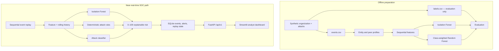

# Architecture

Cold-start resolution follows entity → department → entity type → organization.
Trusted normal events update recent baselines through exponential decay;
anomalous events are excluded from profile updates.
